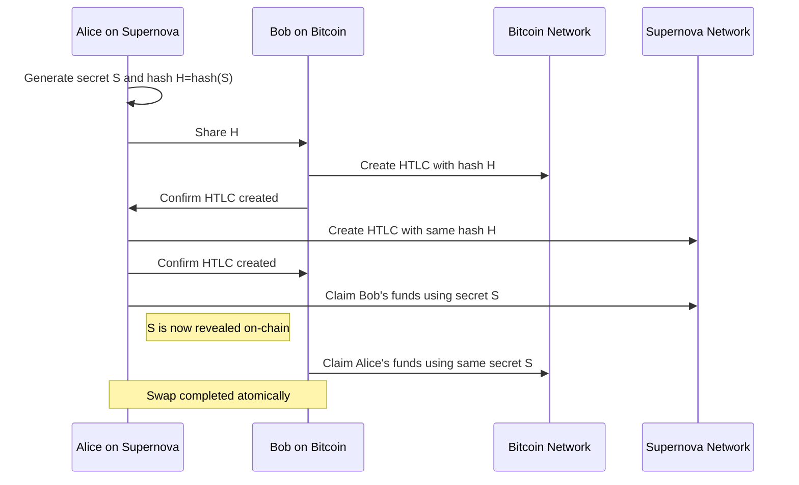

# Cross-Chain Interoperability

Supernova is developing robust cross-chain interoperability solutions to enable seamless asset transfers, data exchange, and composability across multiple blockchain networks. This document outlines the current implementation status and upcoming features.

## Current Implementation Status

Supernova's cross-chain interoperability layer is currently under active development. The following components are in various stages of implementation:

### ✓ Completed Features

- Basic hash time-locked contract (HTLC) infrastructure
- Cross-chain message format standardization
- Transaction verification for Bitcoin-compatible chains
- Cryptographic proof validation framework
- Federated multi-signature bridge foundation

### ⟳ In-Progress Features

- Trustless atomic swap protocol for BTC, ETH, and other major chains
- Generalized state verification for smart contract platforms
- Light client implementations for partner chains
- Zero-knowledge proof integration for private cross-chain transfers
- Cross-chain decentralized exchange protocol

### ○ Planned Features

- Direct interoperability with layer 2 solutions (rollups, state channels)
- Cross-chain smart contract composability
- Decentralized bridge governance system
- Quantum-resistant cross-chain communication
- On-chain verification of foreign chain block headers

## Atomic Swap Protocol

The Supernova atomic swap protocol enables trustless exchange of assets across different blockchain networks without requiring custodial intermediaries.

### Technical Implementation

Supernova's atomic swap implementation uses Hash Time-Locked Contracts (HTLCs) with the following enhancements:

1. **Multi-Phase Commitment**: Leverages a three-phase commitment process to ensure safety
2. **Quantum Resistance**: Optional quantum-resistant hash functions for long-term security
3. **Privacy Enhancement**: Zero-knowledge proofs for private swap execution
4. **Automatic Refund**: Time-based automatic refunds with configurable timeouts
5. **Fee Optimization**: Dynamic fee adjustment based on network conditions

### Supported Chains

| Blockchain | Status            | Swap Types                  | Notes                                      |
|------------|-------------------|-----------------------------|--------------------------------------------|
| Bitcoin    | ✓ Complete        | UTXO-based                  | Full support with P2SH and P2WSH           |
| Ethereum   | ⟳ In Progress     | Account-based, ERC-20, ERC-721 | Smart contract implementation in testing   |
| Solana     | ⟳ In Progress     | SPL Tokens                  | Program implementation in testing          |
| Cosmos     | ⟳ In Progress     | IBC Integration             | Using IBC protocol for interoperability    |
| Polkadot   | ○ Planned         | Cross-parachain             | XCMP-based implementation planned          |
| Cardano    | ○ Planned         | Native, Token               | EUTXO model adaptation in design          |

### Sample Atomic Swap Flow



## Bridge Infrastructure

Supernova is implementing a multi-layered bridge solution for more complex cross-chain interactions beyond simple asset transfers.

### Bridge Architecture

The bridge infrastructure consists of three main components:

1. **Verification Layer**: Validates the authenticity of cross-chain messages
   - Light client implementations for major chains
   - Merkle proof verification
   - Stake-based validator network

2. **Transport Layer**: Ensures reliable message delivery
   - Message queuing system
   - Retry mechanisms
   - Incentivized relayer network

3. **Execution Layer**: Processes the cross-chain instructions
   - Contract call framework
   - Asset minting/burning
   - State synchronization

### Security Model

The security of the bridge is ensured through a combination of:

- **Multi-Party Computation (MPC)**: For signing cross-chain transactions
- **Stake-Based Validation**: Validators stake NOVA tokens as collateral
- **Fraud Proofs**: Allows challenging invalid state transitions
- **Governance Oversight**: Emergency shutdown capability

### Performance Considerations

The bridge architecture balances security and performance through:

- Batched message processing
- Optimistic validation with delayed finality
- Parallel processing of independent transactions
- ZK-rollup inspired compression techniques

## Cross-Chain Smart Contract Platform

A key upcoming feature is the cross-chain smart contract platform, allowing developers to build applications that span multiple blockchains.

### Cross-Chain VM

The Cross-Chain Virtual Machine (CCVM) provides:

- Common execution environment across chains
- Cross-chain state access primitives
- Unified gas model for multi-chain execution
- Language-agnostic interface for blockchain communication

### Smart Contract Interface

Developers will be able to use a unified interface for cross-chain operations:

```solidity
// Example interface for cross-chain contract calls
interface ICrossChainCall {
    // Send a message to another chain
    function sendMessage(
        uint256 targetChainId,
        address targetContract,
        bytes calldata data,
        uint256 gasLimit
    ) external payable returns (bytes32 messageId);
    
    // Receive a message from another chain
    function receiveMessage(
        uint256 sourceChainId,
        address sourceContract,
        bytes calldata data,
        bytes calldata proof
    ) external returns (bool);
}
```

### Use Cases

The cross-chain smart contract platform enables several advanced use cases:

1. **Cross-Chain DeFi**:
   - Liquidity aggregation across chains
   - Multi-chain yield farming
   - Chain-agnostic lending and borrowing

2. **Unified Digital Identity**:
   - Consistent identity verification across chains
   - Cross-chain reputation systems
   - Portable KYC/AML verification

3. **Gaming and NFTs**:
   - Cross-chain NFT movement and functionality
   - Multi-chain gaming environments
   - Chain-agnostic metaverse assets

4. **Enterprise Solutions**:
   - Cross-chain supply chain tracking
   - Multi-ledger settlement systems
   - Chain-agnostic business logic

## Developer Resources

### Integration Guide

For developers looking to integrate with Supernova's cross-chain features, we provide:

1. **SDKs and Libraries**:
   - JavaScript/TypeScript SDK (available now)
   - Rust client library (available now)
   - Python SDK (in development)
   - Go client library (in development)

2. **API Documentation**:
   - REST API for cross-chain status
   - WebSocket API for real-time updates
   - JSON-RPC methods for wallet integration

3. **Testing Framework**:
   - Local development environment
   - Cross-chain test networks
   - Automated testing tools

### Example Implementation

Basic atomic swap implementation in Rust:

```rust
use supernova_crosschain::{AtomicSwap, SwapParams, ChainIdentifier};

async fn create_swap() -> Result<SwapId, SwapError> {
    // Initialize the cross-chain client
    let client = CrossChainClient::new(config);
    
    // Create atomic swap parameters
    let params = SwapParams {
        source_chain: ChainIdentifier::Supernova,
        target_chain: ChainIdentifier::Bitcoin,
        asset_to_send: Asset::new("NOVA", 1_000_000_000), // 10 NOVA
        asset_to_receive: Asset::new("BTC", 50_000_000),  // 0.5 BTC
        recipient: "bc1qxy2kgdygjrsqtzq2n0yrf2493p83kkfjhx0wlh".to_string(),
        timeout_blocks: 144, // ~24 hours on Bitcoin
        use_quantum_resistant: true,
    };
    
    // Initiate the swap
    let swap_id = client.create_atomic_swap(params).await?;
    
    println!("Swap created with ID: {}", swap_id);
    println!("Share this ID with your counterparty");
    
    Ok(swap_id)
}
```

## Roadmap

The cross-chain interoperability features will be rolled out in phases:

### Phase 1: Foundation (In Progress)
- Complete atomic swap protocol for BTC and ETH
- Deploy relayer network for message passing
- Launch testnet bridge for selected partner chains

### Phase 2: Ecosystem Expansion (Q3-Q4 2025)
- Extend support to 10+ major blockchain networks
- Deploy mainnet bridge with security audits
- Release cross-chain developer SDK

### Phase 3: Advanced Features (Q1-Q2 2026)
- Launch cross-chain smart contract platform
- Implement ZK-proof based private transfers
- Deploy decentralized governance for bridge parameters

## Conclusion

Supernova's cross-chain interoperability is a cornerstone of our vision for a connected blockchain ecosystem. By creating secure, efficient bridges between networks, we're enabling a new generation of applications that can leverage the strengths of multiple chains while providing a seamless user experience.

For more information or to participate in testing, please contact the Supernova development team or join our developer community on Discord. 